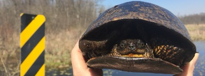

Hello! I'm a scientist researching ecology and evolutionary biology with applications to conservation of biodiversity.

I work mainly on reptiles, amphibians, and fish, and I also use museum specimens extensively in my research.

I am a lecturer / chargé de cours at the [Université de Namur](https://unamur.be/fr) in Belgium and I'm on the lookout for interested graduate students. Feel free to contact me if you are interested!

